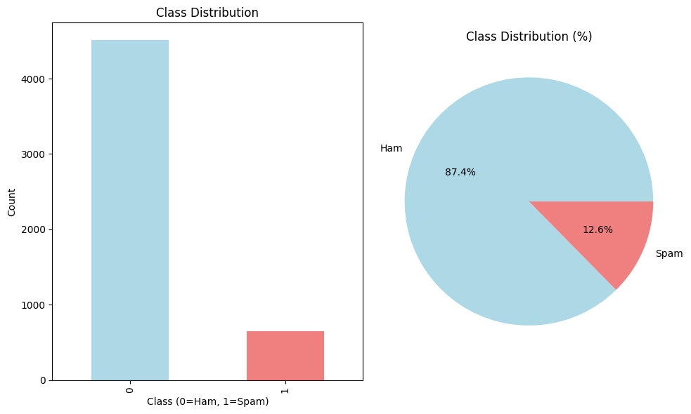
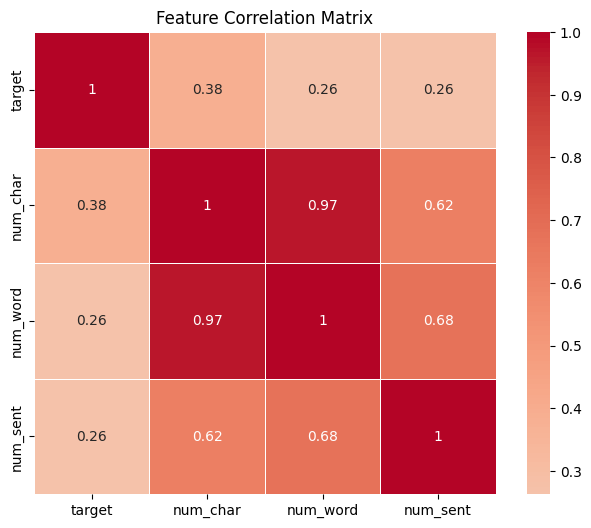
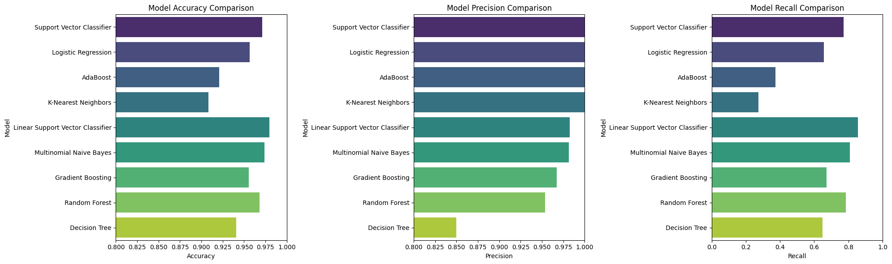
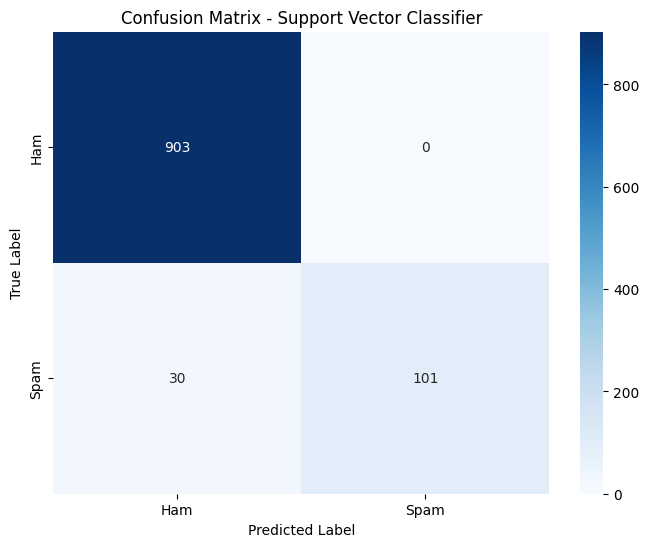
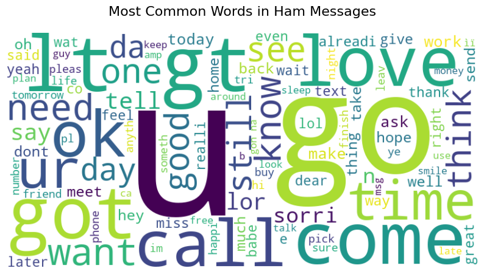
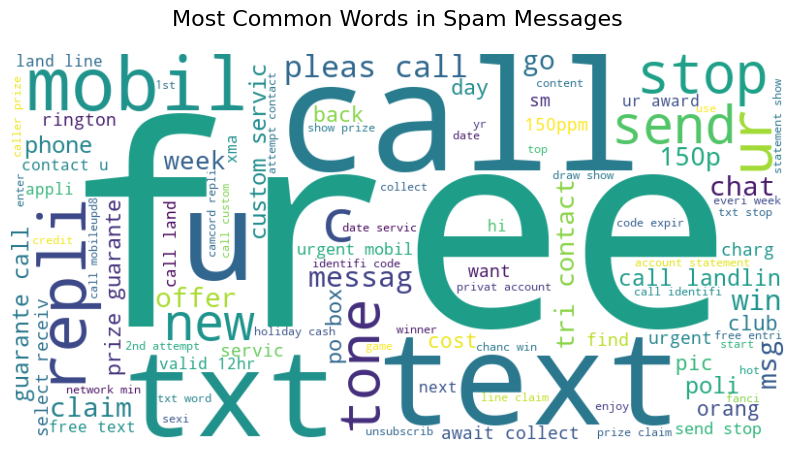
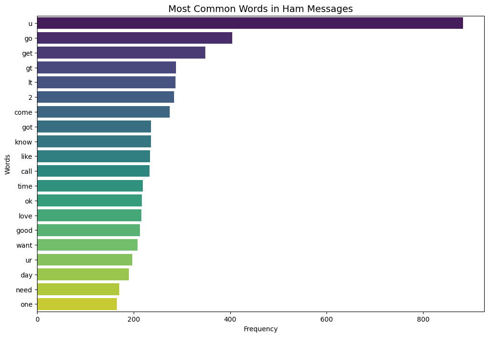
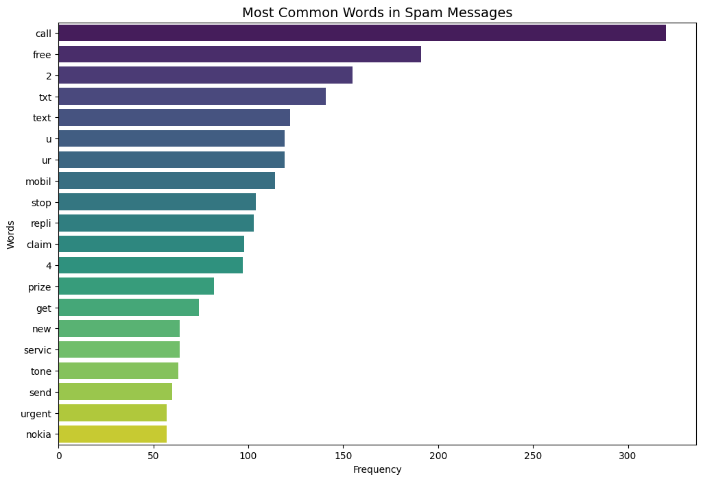

# 🛡️ Email/SMS Spam Classifier

A machine learning-powered web application that accurately classifies emails and SMS messages as spam or legitimate (ham).

## 📋 Table of Contents

- [Business Objective](#business-objective)
- [Problem Statement](#problem-statement)
- [Business Constraints](#business-constraints)
- [Solution](#solution)
- [Visualizations](#visualizations)
- [Results](#results)
- [Future Enhancements](#future-enhancements)
- [Installation](#installation)
- [Deployment](#deployment)

## 🎯 Business Objective

### Primary Goal
Develop a robust and accurate spam detection system that can automatically classify incoming emails and SMS messages to protect users from unwanted, malicious, or fraudulent content.

### Key Objectives
- **Accuracy**: Achieve high classification accuracy to minimize false positives and negatives
- **Precision**: Prioritize precision to avoid blocking legitimate messages
- **User Experience**: Provide instant, reliable classification results
- **Cost Efficiency**: Reduce manual filtering efforts and associated costs

### Business Impact
- **Security Enhancement**: Protect users from phishing, scams, and malicious content
- **Productivity Improvement**: Reduce time spent manually filtering messages
- **User Trust**: Build confidence in digital communication platforms

## 🚨 Problem Statement

### Current Challenges
1. **Spam Volume**: Users receive an overwhelming amount of spam messages daily
2. **Sophisticated Spam**: Modern spam uses advanced techniques to bypass simple filters
3. **False Positives**: Legitimate messages being incorrectly marked as spam
4. **Real-time Processing**: Need for instant classification of incoming messages

### Data Characteristics
- **Dataset**: 5K+ SMS messages
- **Imbalanced Classes**: Severe class imbalance requiring careful handling
- **Text Variety**: Messages vary in length, language, and content type

### Technical Challenges
- **Text Preprocessing**: Handling diverse text formats and languages
- **Feature Engineering**: Extracting meaningful features from text data
- **Model Selection**: Choosing the best algorithm for the specific use case
- **Performance Optimization**: Balancing accuracy with processing speed

## ⚠️ Business Constraints

- **Zero False Positives**: Legitimate messages must never be blocked
- **Real-time Processing**: Classification must be completed within seconds
- **Resource Efficiency**: Limited computational resources in deployment

## 💡 Solution

### Approach Overview
Implemented a comprehensive machine learning pipeline that combines text preprocessing with state-of-the-art classification algorithms.

### Technical Architecture

#### 1. Data Preprocessing Pipeline

#### 2. Feature Engineering
- **TF-IDF Vectorization**: 3K+ most frequent words
- **Text Statistics**: Character count, word count, sentence count
- **Feature Selection**: Correlation analysis for optimal feature set

#### 3. Model Selection Process
Evaluated multiple algorithms:
- Multinomial Naive Bayes
- Logistic Regression
- Support Vector Classifier (SVC)
- Random Forest
- Decision Tree
- K-Nearest Neighbors
- AdaBoost
- Gradient Boosting

#### 4. Model Selection Criteria
1. **Primary**: Highest Precision (100% required)
2. **Secondary**: Accuracy ≥ 95% - As most models meeting the primary criteria
3. **Tertiary**: Highest Recall among qualifying models

### Final Solution
- **Best Model**: Support Vector Classifier (SVC)
- **Vectorization**: TF-IDF with 3K+ features
- **Preprocessing**: Text cleaning pipeline
- **Deployment**: Streamlit web application

## 📊 Visualizations

### 1. Class Distribution

*The dataset shows a significant class imbalance with 87.3% legitimate messages and 12.7% spam messages.*

### 2. Feature Correlation Matrix

*Text length features show moderate correlation with spam classification, with character count being the strongest predictor.*

### 3. Model Performance Comparison

*Support Vector Classifier achieves the best balance of precision, accuracy, and recall among all evaluated models.*

### 4. Confusion Matrix

*The confusion matrix shows perfect precision and high recall for spam detection.*

### 5. Word Clouds
#### Legitimate Messages

*Legitimate messages contain conversational words and personal content.*

#### Spam Messages

*Spam messages contain promotional language, urgency indicators, and financial terms.*

### 6. Common Words Analysis
#### Legitimate Messages

*Most common words in legitimate messages are conversational and personal.*

#### Spam Messages

*Most common words in spam messages are promotional and action-oriented.*

## 🎯 Results

### Model Performance Metrics

| Metric | Value | Description |
|--------|-------|-------------|
| **Accuracy** | 97.1% | Overall classification accuracy |
| **Precision** | 100% | Perfect precision - no false positives |
| **Recall** | 77.1% | Spam detection rate |
| **Specificity** | 100% | Perfect legitimate message identification |
| **F1-Score** | 87.1% | Harmonic mean of precision and recall |

### Key Achievements

#### **Business Requirements Met**
- **Zero False Positives**: 100% precision ensures no legitimate messages are blocked
- **High Accuracy**: 97.1% overall accuracy exceeds the 95% requirement

#### **User Experience**
- **Sample Messages**: Pre-loaded examples for testing
- **Detailed Analysis**: Character count, word count, and processed text display

### Comparative Analysis

| Model | Accuracy | Precision | Recall | Selection |
|-------|----------|-----------|--------|-----------|
| **SVC** | 97.1% | 100% | 77.1% | **Selected** |
| Linear SVC | 98.0% | 98.2% | 85.5% | Lower precision |
| Naive Bayes | 97.4% | 98.1% | 80.9% | Lower precision |
| Logistic Regression | 95.6% | 100% | 65.6% | Lower recall |
| Random Forest | 96.8% | 95.4% | 78.6% | Lower precision |

## 🏆 Future Enhancements

### **Potential Improvements**
- **Deep Learning**: Implement BERT or transformer models for better text understanding
- **Real-time Learning**: Implement online learning for continuous improvement
- **Advanced Features**: URL detection, phone number patterns, emoji analysis

### **Scalability Considerations**
- **API Integration**: Provide REST API for external integrations
- **Performance Monitoring**: Real-time performance tracking and alerting

---

## 🚀 Installation

### Setup Instructions
```bash
# Clone the repository
git clone https://github.com/Pratt33/email-sms-spam-classifier.git
cd email-sms-spam-classifier

# Install dependencies
pip install -r requirements.txt

# Run the application
streamlit run app/app.py
```


## 🌐 Deployment

### Streamlit Cloud
1. Click [Here](https://email-sms-spam-classifier-pratt.streamlit.app/)

---

**Built with ❤️ using Machine Learning**

*For questions or support, please open an issue in the repository.*
